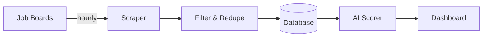

# Auto Job App

An AI-powered job search pipeline that scrapes, scores, and surfaces the best remote roles — so I can focus on interviewing, not searching.

---

Job hunting is a full-time job. I got tired of refreshing five different job boards, skimming hundreds of listings, and losing track of which ones were actually worth applying to. So I built a system that does it for me — scrapes listings across multiple boards, scores every role against my actual preferences using Claude, and serves up a ranked dashboard of what's worth my time.

## How It Works

## What Makes This Interesting

### LLM-Powered Scoring

Claude evaluates every role against a weighted rubric — skills match, seniority fit, salary range, location requirements. This isn't keyword matching. It's contextual evaluation that understands "senior fullstack" and "staff frontend" are closer than "junior backend," even though they share no keywords.

### Autonomous Pipeline

Five job boards scraped on a schedule, listings filtered and deduplicated, matches scored and ranked — all without intervention. The system runs continuously and the dashboard always reflects the latest state of the market.

### Monorepo at Scale

Six-layer package architecture with strict dependency hierarchy, type-safe error handling via a Result pattern, and full CI enforcement across the board. Every package has clear boundaries and explicit contracts. [See the technical details →](./CLAUDE.md)

## Roadmap

- Auto-apply to high-scoring roles
- AI-tailored resumes per role
- AI-tailored cover letters per role
- Analytics dashboard (success rates, score distributions)

---

For architecture details, dependency hierarchy, and code patterns, see [CLAUDE.md](./CLAUDE.md).
